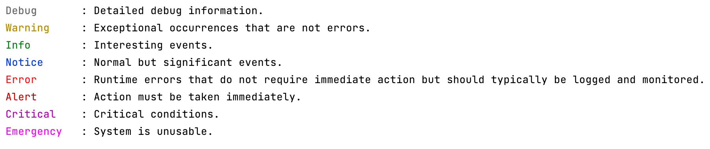

# ColorLogger

A [PSR-3 logger](https://www.php-fig.org/psr/psr-3/) to use during unit tests.

Prints the log level in colour, the message as normal, no time, and no context.



```
composer require --dev brianhenryie/colorlogger
```

Then, presuming your classes [`use LoggerAwareTrait`](https://github.com/php-fig/log/blob/master/Psr/Log/LoggerAwareTrait.php):

```php
$myclass = new MyClass();
$colorLogger = new \BrianHenryIE\ColorLogger\ColorLogger();
$myclass->setLogger($colorLogger);
```
